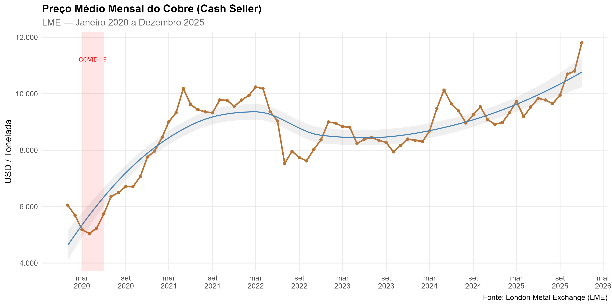
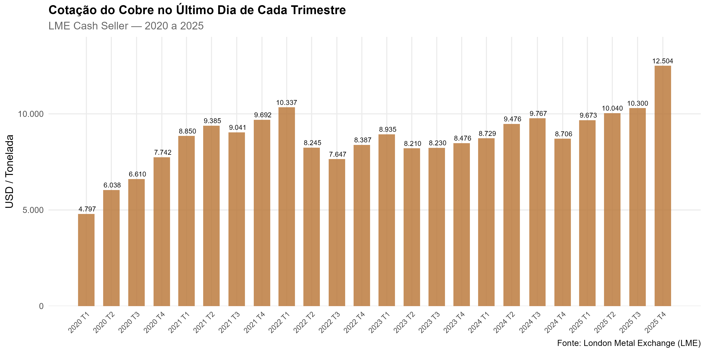
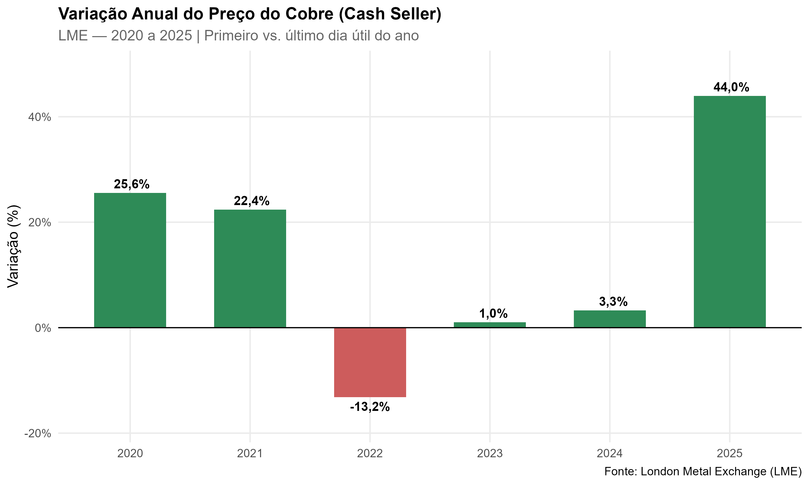

# Análise dos Preços do Cobre (Cash Seller) — LME

Análise das cotações à vista (*Cash Seller*) do cobre na **London Metal Exchange (LME)**, com dados diários de **02/01/2020 a 31/12/2025**.

Consolidação de 72 planilhas mensais em uma série única de **1.516 observações** (dias úteis), com validação cruzada e exportação de planilha de verificação com fórmulas nativas do Excel.

---

## Estrutura do Repositório

```
├── analise_cobre_lme.Rmd      # Código principal — consolidação, análise e gráficos (HTML)
├── respostas_word.Rmd         # Versão para geração do documento Word (.docx)
├── renderizar.R               # Script auxiliar para renderização via terminal
├── output/
│   ├── cobre_cash_seller_2020_2025.csv   # Série consolidada (1.516 dias úteis)
│   └── cobre_verificacao.xlsx            # Planilha com fórmulas de verificação
├── graficos/                  # Gráficos gerados pelo código
│   ├── media_mensal_cobre.png
│   ├── cotacao_trimestral_cobre.png
│   └── variacao_anual_cobre.png
└── README.md
```

---

## Respostas às Perguntas do Case

### 1. Menor cotação do período

**USD 4.617,50/t** em **23/03/2020**, durante o choque inicial da pandemia de COVID-19.

### 2. Maior cotação do período

**USD 12.512,00/t** em **30/12/2025**, refletindo a demanda crescente ligada à transição energética.

### 3. Variação média mensal — 2020 vs. 2024

| Ano  | Variação média mensal |
|------|-----------------------|
| 2020 | **3,32%**             |
| 2024 | **0,37%**             |

A média de 2020 é significativamente maior devido à recuperação acelerada pós-choque pandêmico. Em 2024, o mercado apresentou oscilações mais contidas.

### 4. Variação acumulada (02/01/2020 a 31/12/2025)

**102,81%** — o preço do cobre mais que dobrou no período de seis anos.

### 5. Preço médio mensal



### 6. Cotação trimestral (último dia útil de cada trimestre)



### 7. Variação anual



### 8. Determinantes da trajetória observada

**2020 — Choque pandêmico e recuperação em V.** Queda acentuada entre março e abril com a paralisação industrial causada pela COVID-19. Estímulos fiscais e monetários globais, somados à retomada acelerada da China, conduziram recuperação expressiva no segundo semestre (~26% no ano).

**2021 — Rally das commodities.** Gargalos nas cadeias de suprimento, restrições de oferta em minas no Chile e Peru e a narrativa de transição energética impulsionaram o cobre a máximas históricas (~25% no ano).

**2022 — Correção sob aperto monetário.** Ciclo de alta de juros do Federal Reserve, fortalecimento do dólar e lockdowns prolongados na China pressionaram os preços para baixo (~-14% no ano).

**2023 — Estabilização.** Perspectiva de fim do aperto monetário e reabertura chinesa aquém das expectativas. Restrições de oferta sustentaram um piso para os preços (variação próxima de zero).

**2024 — Retomada gradual.** Expectativa de cortes de juros e aceleração de investimentos em eletrificação (EVs, redes elétricas, data centers para IA) reacenderam o interesse pelo metal.

**2025 — Máximas históricas.** Demanda ligada à transição energética e expansão de infraestrutura de IA elevou o cobre a patamares recordes (~44% no ano).

**Síntese.** A trajetória reflete a transição do cobre de commodity cíclica para ativo estratégico. O descompasso entre demanda crescente (eletrificação, data centers, EVs) e oferta limitada (escassez de novos projetos minerários) sustenta a tendência de longo prazo, moderada por ciclos de política monetária e pela dinâmica da economia chinesa.

---

## Como Replicar

**Pré-requisitos:** R (≥ 4.5) e RStudio.

1. Clone o repositório:
   ```bash
   git clone https://github.com/karinaaxl/analise-cobre-lme.git
   ```
2. Coloque as 72 planilhas `.xlsx` da LME na pasta `Dados/lme_prices (1)/prices/` (um nível acima do repositório).
3. Abra `analise_cobre_lme.Rmd` no RStudio.
4. Execute os chunks sequencialmente (`Ctrl+Alt+R`).

Os pacotes necessários são instalados automaticamente caso não estejam presentes. Para incluir novos meses, basta adicionar os arquivos `.xlsx` ao diretório de dados e reexecutar.

---

## Entregáveis

| Entregável | Arquivo | Descrição |
|---|---|---|
| Respostas (Word) | `output/respostas_cobre_lme.docx` | Documento com respostas às 8 perguntas (gerado via `respostas_word.Rmd`) |
| Planilha consolidada | `output/cobre_verificacao.xlsx` | Série histórica + aba de verificação com fórmulas MIN, MAX, AVERAGE |
| Série em CSV | `output/cobre_cash_seller_2020_2025.csv` | 1.516 observações: data + Cash Seller (USD/t) |
| Relatório HTML | Gerado localmente via `analise_cobre_lme.Rmd` | Relatório interativo com gráficos, tabelas e código reproduzível |

---

*Análise realizada em R 4.5.1 | Pacotes: readxl, dplyr, lubridate, ggplot2, scales, purrr, knitr, kableExtra, openxlsx*
